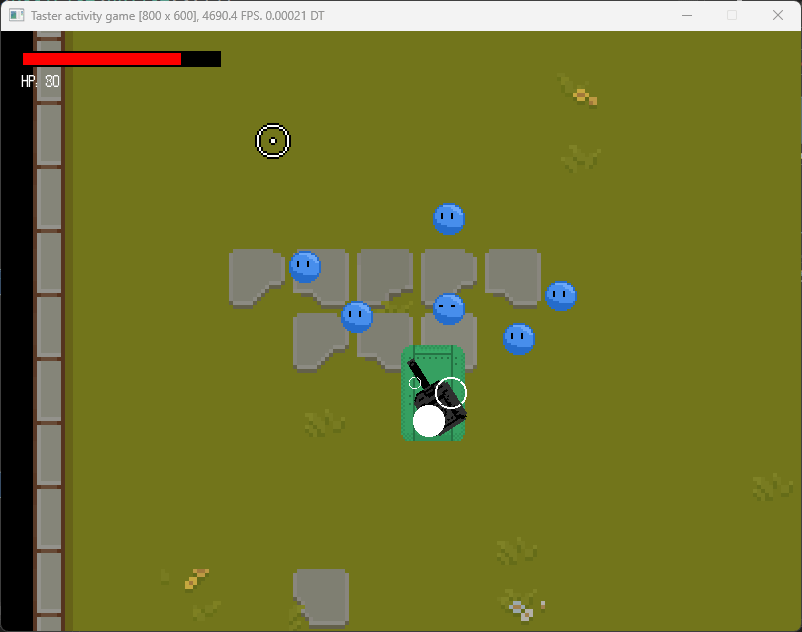

# University of Staffordshire: Top-down SDL Taster Activity
Welcome to the University of Staffordshire! Today we'll be building a small top-down game (see above) in C++. We will be using [SDL 2](https://www.libsdl.org/), a popular library used for building games. Today is designed to give you an idea of what a typical workshop session is like at our institution. If you have any questions about the university, reach out to the staff in session and we'll be happy to help you! 🙂

This activity will involve programming in C++; which is a programming language often used in developing games. In our courses, we teach you C++ completely from the ground up. Don't worry if you've never used C++, or have never programmed before -- today's activity will be beginner friendly! 

If however, you do get stuck, or are perhaps uncertain on some of the instructions, we can help you throughout this session.

We hope you enjoy today's taster session, which should last 45 minutes. Click the link below to proceed to the first step!

-------------

    <a href="./md/step-1.md" ><code style="padding: 5px;">Get started 🡒</code></a>

