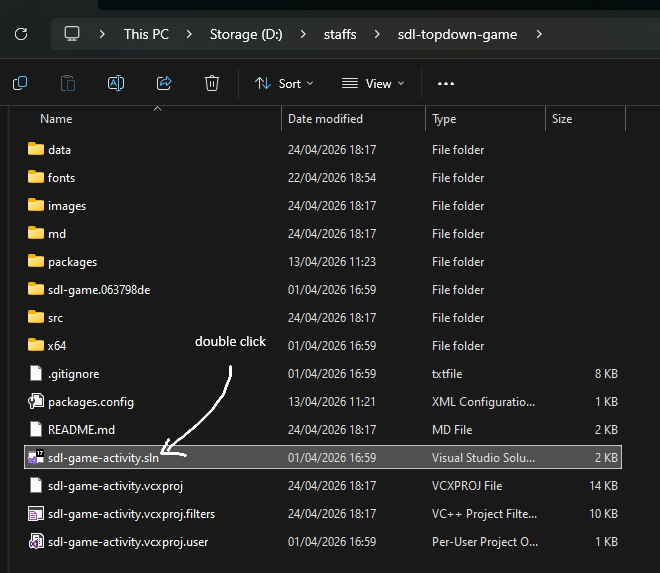
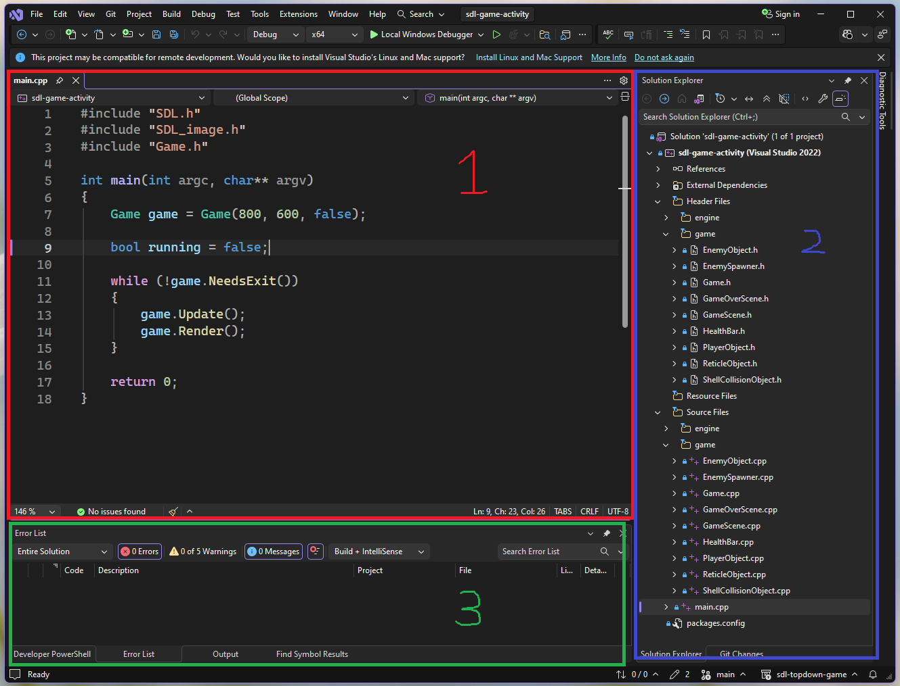
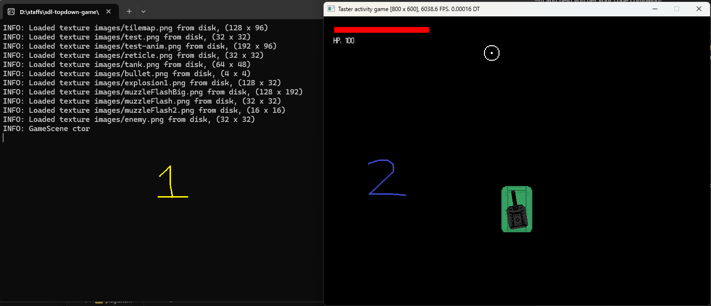

    <table>
        <tr>
            <td><a href="../README.md">🡐 Previous step</a></td>
            <td><a href="./step-2.md">Next step  🡒</a></td>
        </tr>
    </table>

&nbsp;
&nbsp;

# Step 1
## Familiaring yourself
Before we start modifying the code, let's get familiar with Visual Studio. If you've used Visual Studio before, you likely can skip this step as we primarily explore the editor.

Visual Studio is an Integrated Development Environment (IDE) for a variety of programming languages, including C++. An IDE is essentially a code editor with some additional functionality, such as the ability to debug and run your game with the click of a button. It is a tool often found in the games industry -- lots of development teams use Visual Studio for C++ engine development!

## Opening
Firstly, Visual Studio should be open on your screen. If it is, you can skip to the next step. If it is not, use the **Taskbar** to select the file explorer (it should be a folder icon), or use `Alt+Tab`. In this folder, double click on the `sdl-topdown-game.sln` file (see below).

This should open up Visual Studio. If Visual Studio asks you to sign in, click `Skip`. You should see an interface similar the one below:

There are three panels here which we will be using throughout this task.

## Code editor
The code editor *(red panel 1 in above image)* is the main section of Visual Studio which you will be using. In here you can edit the C++ code of the project, which is most of what we will be doing today. The interface supports multiple tabs which can be opened and closed -- one for each source file. A C++ project is built up of many files, and in the project we will be using, there is quite a lot of files. However, don't let this scare you! We won't be touching many of these, only a few.

The code editor supports many common hotkeys, e.g. `Ctrl+Z`/`Ctrl+Y` for undo/redo, `Ctrl+X` for cut, `Ctrl+C` for copy, `Ctrl+V` for paste, etc. There are also a lot of Visual Studio specific shortcuts. Here are some useful ones:

| Keycode | Description |
|-------|---|
|`Alt+ArrowUp` / `Alt+ArrowDown` | Move current line of code up/down.
| `Ctrl+D` | Duplicate existing line of code.
| `Alt+Shift+.` | Multi-cursor select current word.
| `Ctrl+F` | Find in current file.
| `Ctrl+H` | Find/replace in current file.
| `Ctrl+Shift+H` | Find/replace throughout entire project.
| `Ctrl+Shift+F` | Find throughout entire project.
| `Ctrl+K` followed by `Ctrl+C` | Comment selected region of code.
| `Ctrl+K` followed by `Ctrl+U` | Uncomment selected region of code.
| `Ctrl+K` followed by `Ctrl+O` | Switch between `.h` and `.cpp` of selected file.
| `Ctrl+Click` function name | Navigate to function in code.

You can use the *Navigation bar* of the code editor to easily swap between functions -- this might make navigating throughout the code for this session a little easier. These are the three dropdown boxes at the top of the tab. The left most is the project drop down, we won't be using this. The middle is the **class** selector, and the right-most is the **function** selector. These are shown below.

Here #1 can be used to select the current class, and #2 can be used to quickly navigate to the portion of code for the selected function.

## Solution explorer
The solution explorer *(blue panel 2 in above image)* is how you can navigate between files in the project. If the tutorial tells you to "open a file", it means to double click on that file in this panel. Normally, source code files are named after their functionality -- e.g. the `HealthBar.cpp` and `HealthBar.h` files deal with rendering the player's health bar to the screen.

> [!TIP]
> If you accidentally close this window, you can press `Ctrl+Alt+L` to reopen it at any time.

In C++, there are primarily `.h` and `.cpp` files. There are other types of files we may use (e.g. `.hpp`), but these are the main file types used in this game. A `.h` file is a **header file** and usually contains declarations and other definitions -- for example, including various files which are needed to compile this unit. A `.cpp` file is a **source file** and usually contains the implementation of declarations specified in the header file. If this is a little confusing, think of header files as "introductory" information, where as source files are the "meat and potatoes" of the code.

For the purposes of this session, we will only be modifying `.cpp` files; but if you've written C++ before and want to poke around more in the project, be our guest! 😊

## Error list / Output
The bottom-most *(green panel 3 in above image)* panel gives us information about the output of building the game. The ordinary development process is to modify the code in one or more files, compile the code, and see if there were any errors when building. It can be the case that the code we write is invalid, and this panel will give us useful information about what went wrong.

This is also true of run-time debugging; from this panel we can examine the call stack, for example. If you get an error during this session, this panel will give you more of an idea as to what went wrong. If you don't understand it, that is what we're here for today -- we can walk you through the problem and help you get your code compiling!

## Play button
Finally, above the code editor is a **play button** titled `▶️ Local Windows Debugger`. This is what we will be clicking to test out the game after we make changes to the source code. This button does a few things:

- Checks the syntax of the code to see if it is syntactically correct.
- Try to compile the code into an executable file.
- If successful:
    - It runs the game in its current form, so you can test it out.
- If unsuccessful:
    - It shows a list of errors it encountered during the build process.

# Getting started
With all that in mind, let's get started! We have quite a few things we are going to do to get various bits of game functionality working. Namely:

- `GameScene.cpp`
    - Load tilemap from disk
    - Camera movement
- `PlayerObject.cpp`
    - Move player
    - Firing shells
    - Firing bullets
    - Damage player
    - Load GameOver screen
- `EnemySpawner.cpp`
    - Spawner timer 
- `EnemyObject.cpp`
    - Enemy movement
    - Enemy attack
    - Enemy damage

The first thing to do is to try out the game. To do this, click the **Play button** mentioned above. Two windows should open, showing the game in its current form:

The game window *(2 in above image)* is the actual game with which you can interact. The controls for the game are as follows, though, some of these might not work just yet:
- `WASD`: Move.
- `Mouse Left click`: Fire cannon.
- `Mouse Right click` (hold): Fire gun.
- `Mouse movement`: Aim.
- `Escape`: Quit game.
- `R`: Restart game (on Game Over screen).

You may notice, however, that there is barely anything in the game and it doesn't work. That is what we're going to do today -- we'll be filling in the gaps! 😊

The console window *(1 in above image)* is the debug console which we can use to print out useful debugging information. We won't use this too much today, however, it is incredibly useful when you are debugging in C++. As you can see, it is telling us currently that the textures of the game have been successfully loaded.

## Next up..
In the next step, we will be making the tilemap load in correctly and adding some camera movement!

    <table>
        <tr>
            <td><a href="../README.md">🡐 Previous step</a></td>
            <td><a href="./step-2.md"><b>Next step  🡒</b></a></td>
        </tr>
    </table>

