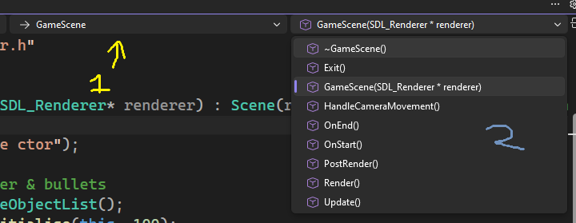
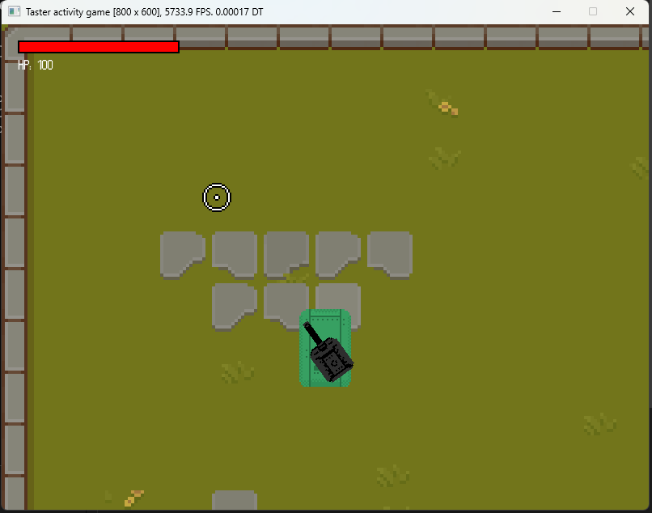

<p align="center">
    <table>
        <tr>
            <td><a href="./step-1.md">🡐 Previous step</a></td>
            <td><a href="./step-3.md">Next step  🡒</a></td>
        </tr>
    </table>
</p>


&nbsp;
&nbsp;

# Step 2
## Loading the tilemap
The first thing we'll do is to give the game a background, as at the moment, it is just a solid black colour. This is a little too drab! 

Firstly, open up the `GameScene.cpp` file by double clicking it in the solution explorer. Then, find the `GameScene` constructor, specifically the line: 

```cpp
GameScene::GameScene(SDL_Renderer* renderer) : ...
```

You can do this by either:
- Using the **Navigation bar** of the code editor, i.e.: 
- Scrolling down in the code until you see it.
- Using `Ctrl+F` and searching for `GameScene::GameScene`.


Within this function, you should see a variety of comments. These are typically coloured in green. Find the comment which says:

```cpp
//Add code to load tilemap from disk here.
```

Underneath this line, we need to add a single line of code to load the tilemap. Copy and paste the following line of code, placing it underneath the commented line:

```cpp
tilemap->LoadFromDisk("data/map.json");
```

Save `GameScene.cpp` by pressing `Ctrl+S`. Then, press the **Play button* to test the game. You should see a background!



> [!INFO]
> The game loads the tilemap data from the `data/map.json` file. This is exported via an online tilemap editor named SpriteFusion, if you are curious about changing the background. The tileset can be modified by altering the `images/tilemap.png` texture.

## Adding camera movement
Next up, we need to make the camera follow the player, and move slightly towards the aiming reticle. This makes the game feel a little nicer. The player doesn't currently move, but when they do, we will automatically have the camera moving with them!

Navigate to the `HandleCameraMovement` function in `GameScene.cpp`. You should see a comment prompting you as to where the code should go:

```cpp
//Add code to handle camera movement here.
```

Underneath this line, paste the following code:

```cpp
float camMoveDist = 24.0f;

Vector2 playerPos = GetPlayerPos();
Vector2 mousePos = GetMouseScreenPos();

//Set camera position
Vector2 camOffsetPos = playerPos + mousePos * camMoveDist;
camera->SetPosition(camOffsetPos);
```

There is a few things going on here. Firstly, we get the player's position (the tank) and the mouse position (in the world). We then calculate where the camera needs to be: `playerPos + mousePos * camMoveDist`. This moves the camera to be around the player, and moves slightly towards the cursor. Finally, it sets the camera's position to this calculated position.

Things to try:
- Play the game and see what happens when you move the mouse.
- Try change the `camMoveDist` value from `24.0f` to `50.0f`.
- Try the value `2.0` instead; play with this value until you get something you like.

For those with programming experience:
- **Stretch task**: Investigate why a high value which is odd (e.g. `75.0f`) causes the tilemap rendering to tear (flickering lines), when the mouse is moved. Why, for example, does an even value like `128.0f` cause much less flickering?

<p align="right" style="float: right;">
    <table>
        <tr>
            <td><a href="./step-1.md">🡐 Previous step</a></td>
            <td><a href="./step-3.md">Next step  🡒</a></td>
        </tr>
    </table>
</p>
