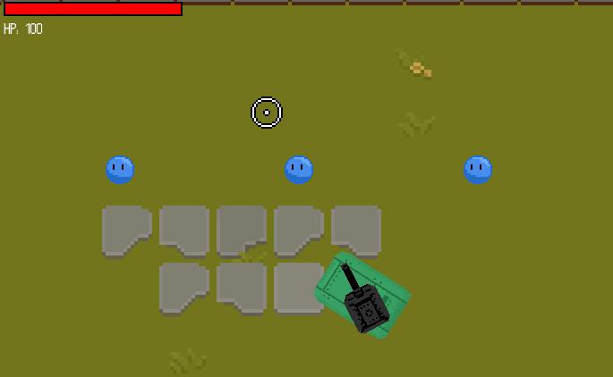

<p align="center">
    <table>
        <tr>
            <td><a href="./step-3.md">🡐 Previous step</a></td>
            <td><a href="./step-5.md"><b>Next step  🡒</b></a></td>
        </tr>
    </table>
</p>


&nbsp;
&nbsp;

# Step 4
## Enemies
We now have a tank which moves correctly and shoots. We even have some juicy particle effects. However, we are missing a key part of the game: enemies to kill! 

There are a few things we need to consider with enemies:
- Spawning them over time.
- Moving them towards the player.
- Player -> enemy damage.
- Enemy -> player damage.

We will tackle each one of these in turn in this step!

### Spawning enemies
To spawn enemies, we simply need to make instances of the `Enemy` class and add them into the game over time. We could make an elaborate wave spawning system, however, given this session's length, this might be a task for you to try when you get home. For now, we'll build a simple timer-based system where we spawn enemies over a fixed interval.

We have already used timers when we considered the gun example, which spawns bullets over time. Perhaps we can reuse this functionality but spawn enemies instead -- this is exactly what we'll do. But before that, we need to consider *where* we are going to spawn the enemies. For this, we need some spawnpoints. 

The spawnpoints for this game are located in `data/spawnpoints.json`. To open this file up in the editor: 
- Go to the **Solution explorer**.
- Open up the **Resource Files** filter.
- Double click on **spawnpoints.json**. 

In here, you'll see three spawnpoints at $(50, 50)$, $(100, 50)$ and $(150, 50)$. You can add more to this file by adding more rows. If you don't know what is going on here, don't worry -- these spawnpoints will do us fine.

> [!INFO]
> For those interested in adding more spawnpoints to this file, make sure you don't add a comma after the last element in the array. Furthermore, if you are interested in finding the position of the player (so you can put the coordinates into this file), add `SDL_Log("player pos: %s", GetPosition().ToString().c_str());` to your `PlayerObject::Update()` function. Then, look at the console while you are playing the game.

Firstly, open up `EnemySpawner.cpp`. Inside, you may notice a few things:
- A `spawnTimer = Timer(1.0f)` line in the constructor. This is creating the spawn timer, such that enemies will spawn every `1.0` second. Feel free to change this to whatever value you thing is best.
- The `LoadSpawnpointsFromDisk` is already made for us, so we don't have to load in the JSON ourselves!
- An `EnemySpawner::Update()` function which currently has nothing in it.

We are going to add some code to update the timer, and spawn an enemy if the timer has elapsed. Within the `Update` function, paste the following below the first comment:

```cpp
if (spawnTimer.Tick())
{
    //More enemies than spawn cap? Skip!
    if (Game::GetEnemiesCurrentlySpawned() >= spawnCap)
        return;

    //Make the enemy
    EnemyObject* enemy = new EnemyObject(parent);

    //Select a random spawn point, move enemy there
    SDL_FPoint randomSpawnpoint = Random::Select(spawnPoints);
    enemy->SetPosition(Vector2(randomSpawnpoint));

    //Add the enemy to the scene!
    parent->GetObjects()->Add(enemy);
}
```

Save the file and press play. You should see some enemies spawning now -- but currently they are static!




## Moving the enemies
Static enemies aren't very interesting, so let's get them moving. For this game we are going to implement a very basic AI:
- The enemies move directly towards the player.
- They stop at a certain radius around the player.
- They then attack the player over time.

To get started, open up the `EnemyObject.cpp` file. This is quite a large file with a lot going on, so don't worry if things are a little confusing. 

Find the `Update()` function and the comment:
```cpp
//Add enemy movement code here.
```

Below this comment, add:
```cpp
Vector2 dirToPlayerNorm = GetDirectionToPlayer().Normalized();
components->rigidbody->SetVelocity(dirToPlayerNorm * speed);
```

This finds the direction towards the player and set's the enemy's velocity such that it moves in this direction. Here the `speed` value is the speed which they move at. If you want to tweak this, see the constructor (`EnemyObject::EnemyObject`), specifically the line:

```cpp
this->speed = Random::Range(10, 20);
```

This sets the enemy's speed to a random value between 10 and 20. Try change these values to something which you think feels nice. This is a hard balance to find -- you don't want the enemies too slow (as the game is easy), but speeding them up too much makes the game difficult. Try find a nice value to settle on.

We then need to stop the enemy when they reach the player. Find the `HandleAttackPlayer` function. Find the comment towards the end of the function:
```cpp
//Add enemy attack code here.
```
This is where we will add the attack code later. For now, add the following line below it:

```cpp
//Stop the enemy
components->rigidbody->SetVelocity(Vector2::zero);
```

This sets the velocity of the enemy when they reach the player. Finally, save everything and play the game -- you should see enemies moving towards the player.

## Enemy $\rightarrow$ Player damage
You may have noticed, there is a HP bar in the top left of the game. So far, this has not changed at all. This because the enemies don't damage the player just yet. They just move towards the player and stop at a certain distance.

The next thing we'll do is actually damage the player. Below the line you just added (`components->rigidbody->SetVelocity(Vector2::zero)`), add the following:

```cpp
if (damageTimer.Tick())
{
    //Damage the player
    playerObj->Damage(enemyDamageAmount);

    //Find a random position around the player and spawn an effect
    Vector2 vfxSpawnPos = GetPlayerPos();
    vfxSpawnPos += Random::InUnitCircle() * 10;
    VFXManager::SpawnEffect(vfxSpawnPos, "explosion-1", 12, 0.5f);
}
```

This firstly increments the damage timer. If it has reached the attack time, we damage the player by calling `playerObj->Damage(enemyDamageAmount)`. The `enemyDamageAmount` is the amount of damage that will be applied to player. Then, we add some optional VFX to tell the player that they are being damaged: some random small explosions on top of the tank sprite.

Things to do:
- Save everything and press play. Test it out.
- You might notice that the health bar is still not going down! 🤔

### Changing player health

This is because we're not out of the woods yet! We need to add the logic to damage the player. This means we have to go *back* to `PlayerObject.cpp` and fill in the `Damage` function. 

Firstly, open up `PlayerObject.cpp` and find the `Damage` function. Under the first comment, add:

```cpp
if (playerDead)
	return;

this->health -= value;

if (this->health <= 0.0f)
{
	this->health = 0.0f;
	playerDead = true;
	OnPlayerDie();
}
```

This decrements the player's health by the value, and triggers the `OnPlayerDie` method if health is `<= 0.0f`. Save this up and press play; you should now see the health bar decreasing when enemies attack you!

You might notice however that nothing happens when the player dies. This is because we need to load the game over screen when this happens. We can do this in the `OnPlayerDie` function, as this is called when the player does indeed die. Navigate to this function (it's just below `Damage()`) and below the first comment, add a single line:

```cpp
SceneManager::Instance().LoadScene("gameOverScene");
```


## Player $\rightarrow$ Enemy damage
We're almost there! The last thing to do is to add damage from the player to the enemies. Or rather, damage from the *bullet* and *shell* objects spawned by the player. Without this, the player has no way of fending off enemies, and the game is not really fun to play!

Save up `PlayerObject.cpp` and go back to the `EnemyObject.cpp` file. In here, we need to two things:

- Fill in what happens when the enemy hits a bullet. (`OnCollisionWithBullet`).
- Fill in what happens when the enemy hits a shell. (`OnCollisionWithShell`).

### Bullets
Let's start with bullets. Navigate to the `OnCollisionWithBullet` function. Find the comment:
```cpp
//Add code here to deal with bullet collisions.
```

Underneath this, add the following code:
```cpp
//Damage the enemy
this->health -= 35.0f;

if (this->health <= 0.0f)
    OnEnemyDie();

//Explosions and VFX
VFXManager::SpawnEffect(bulletPosition, "explosion-1", 12, 0.25f);
this->ApplyHurtEffect(0.1f, SDL_Color { 255, 0, 0, 255 });
```

This decreases the enemies health by `35.0` every time a bullet hits. If their health is below (or equal to) `0.0`, then we call `OnEnemyDie()`, which triggers the deletion of the enemy.

Save it up and try play the game, you should see that enemies are damaged and are deleted from the scene appropriately!

Things to experiment with:
- Currently `35.0f` is a static value. Try change this to lower and higher values until you settle on a nice middle ground for enemies. You can then use `Random::Range(low, high)` to generate a random number between a low and high value. For example, `Random::Range(10, 20)` will select a random amount of damage to deal, between `10` and `20`, e.g. `15.783`.
- Explore what `ApplyHurtEffect` is doing. What if:
    - You comment it out?
    - You change `0.1f` to `1.0f`? or `0.2f`?
    - **Stretch task**: Try change the bullet speed to something ridiculously quick, e.g. `1000.0f`. You may notice that sometimes collision is not triggered. Why do you think this is? Don't forget to change it back.

### Shells
Finally, navigate to `OnCollisionWithShell` (just above `OnCollisionWithBullet`). This one is short and simple: when the enemy collides with a shell, we just kill the enemy. Below the first comment, add:

```cpp
//Kill this enemy
OnEnemyDie();
```


### More VFX (optional)
Now you have used `SpawnEffect` and `CameraShake`, add some more VFX to make the game a little more juicy. For example, you could add an explosion when the enemy dies, under `OnEnemyDie`:

```cpp
VFXManager::SpawnEffect(GetPosition() + Vector2(4, 4), "explosion-1");
```

But why stop at one explosion? Why not 5 randomly around the enemy?

```cpp
//Add more explosions!
for (int i = 0; i < 5; i++)
{
    Vector2 randomPos = GetPosition() + Random::InUnitCircle() * 10;
    VFXManager::SpawnEffect(randomPos, "explosion-1", 16, Random::Range(0.25f, 0.5f));
}
```

And maybe some more camera shake!

```cpp
VFXManager::CameraShake(0.05f, 2);
```

<p align="right" style="float: right;">
    <table>
        <tr>
            <td><a href="./step-3.md">🡐 Previous step</a></td>
            <td><a href="./step-5.md"><b>Next step  🡒</b></a></td>
        </tr>
    </table>
</p>
